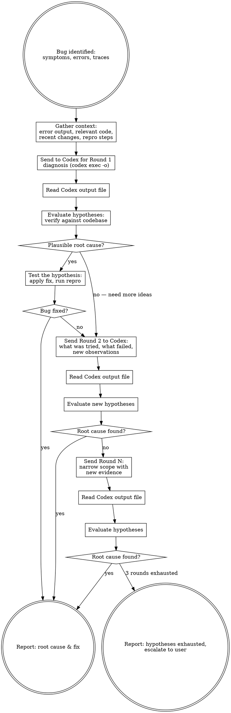

# Codex Debugger

## Overview

Use OpenAI Codex CLI to get an independent debugging perspective on a specific bug, then iterate until root cause is identified and a fix is confirmed.

**Core principle:** A fresh pair of eyes catches what you miss. When you're stuck on a bug, send Codex the full context — symptoms, traces, relevant code — and collaborate on hypotheses until the root cause is found.

## When to Use

- When stuck on a bug after initial investigation
- When a test failure has a non-obvious root cause
- When you want a second opinion on a debugging hypothesis
- When error messages or stack traces point to unfamiliar code paths

## The Process



## Step-by-Step

### Step 1: Gather Bug Context

Collect everything Codex needs for effective debugging. The more context, the better — debugging is harder than reviewing.

**Required context:**
```bash
# 1. Error output / stack trace / test failure
# Capture the exact error message, full stack trace, or test output

# 2. Relevant source code — read the files involved in the error
# Use Read tool on each file referenced in the stack trace or error

# 3. Recent changes that might have introduced the bug
git status
git log --oneline -10
git diff HEAD
git diff --cached

# If working against a branch, diff against the base
git diff main...HEAD
# Or diff a specific suspect range (adjust as needed)
# git diff <last-known-good-commit>..HEAD

# 4. Git blame on the failing lines (when was it last changed?)
git blame -L <start>,<end> <file>
```

**Also gather:**
- Bug description: what's expected vs what's happening
- Reproduction steps (command, test, or user action)
- What you've already tried and ruled out
- Any relevant configuration or environment details

### Step 2: Send to Codex (Round 1 — Diagnosis)

Use `codex exec` with `-o` (`--output-last-message`) to write the final diagnosis to a file you can read back. Codex streams progress to stderr; the final agent message goes to stdout and the `-o` file.

**Important:** Do NOT use `codex review` with stdout redirection — it uses a TUI that doesn't produce output when piped. Always use `codex exec -o`.

Give Codex **read-only** sandbox access so it can explore the codebase for additional context.

```bash
# Generate a unique output file per round
DEBUG_FILE="/tmp/codex-debug-$(date +%s)-r1.md"

codex exec \
  --skip-git-repo-check \
  --sandbox read-only \
  -o "$DEBUG_FILE" \
  "You are a debugger. Diagnose the root cause of the following bug. Be systematic: list hypotheses ranked by likelihood, cite specific file:line references, and suggest targeted fixes.

Bug description: {WHAT_IS_EXPECTED_VS_ACTUAL}

Error output / stack trace:
{ERROR_OUTPUT}

Reproduction steps:
{REPRO_STEPS}

Relevant source code:
{RELEVANT_CODE_SNIPPETS_WITH_FILE_PATHS}

Recent changes (possible regression):
{RECENT_DIFF_OR_COMMITS}

What has already been tried:
{WHAT_WAS_RULED_OUT}

Please provide:
1. Ranked list of hypotheses (most likely first)
2. For each hypothesis: the specific code path that would cause this, with file:line references
3. Suggested diagnostic steps to confirm/reject each hypothesis
4. A proposed fix for the most likely root cause"
```

**Security notes:**
- Use `--sandbox read-only` — Codex needs to read code but should never modify it
- Never use `--dangerously-bypass-approvals-and-sandbox` for debugging
- Review the output file before acting on suggestions

**Always include in the prompt:**
- Exact error messages and stack traces (not paraphrased)
- Relevant source code with file paths and line numbers
- What has already been tried and eliminated
- Any constraints (e.g., "this code is on the hot path, no allocations")

### Step 3: Read and Evaluate Hypotheses (receiving-code-review)

Read the output file, then apply `superpowers:receiving-code-review` discipline to evaluate each hypothesis Codex proposes.

For each hypothesis:

1. **VERIFY** — Does the proposed code path actually exist? Check file:line references against the actual codebase
2. **TEST** — Can you confirm or reject the hypothesis?
   - Read the referenced code to check if the logic matches Codex's claim
   - If Codex suggests a diagnostic step (add a log, check a value), try it
   - Run the reproduction steps after applying a targeted fix
3. **CATEGORIZE:**
   - **Confirmed:** Evidence supports this as root cause — apply fix
   - **Rejected:** Evidence contradicts the hypothesis — note why and push back
   - **Plausible:** Can't confirm yet — needs more investigation
4. **Apply the most promising fix** and test

**No performative agreement.** If Codex's hypothesis is wrong — the code path doesn't exist, the logic doesn't work that way, or the claim contradicts observed behavior — say why and move on. Codex is working from limited context and will make incorrect claims about the codebase.

### Step 4: Round 2 — Narrow the Scope

If the bug persists after testing Round 1 hypotheses, send Codex updated context:

```bash
DEBUG_FILE_R2="/tmp/codex-debug-$(date +%s)-r2.md"

codex exec \
  --skip-git-repo-check \
  --sandbox read-only \
  -o "$DEBUG_FILE_R2" \
  "Round 2 debugging. The bug persists. Be systematic: list hypotheses ranked by likelihood, cite specific file:line references, and suggest targeted fixes.

Original bug: {BUG_DESCRIPTION}

Original error output / stack trace:
{ERROR_OUTPUT}

Reproduction steps:
{REPRO_STEPS}

Relevant source code:
{RELEVANT_CODE_SNIPPETS_WITH_FILE_PATHS}

Round 1 hypotheses and results:
{EACH_HYPOTHESIS_AND_WHY_IT_WAS_CONFIRMED_OR_REJECTED}

New observations from testing:
{NEW_EVIDENCE_FROM_DIAGNOSTIC_STEPS}

Additional code context discovered:
{NEW_RELEVANT_CODE}

Please:
1. Revise your hypotheses based on the new evidence
2. Suggest deeper diagnostic steps (e.g., intermediate values to inspect, invariants to check)
3. Consider less obvious causes: initialization order, concurrency, configuration, environment differences"
```

### Step 5: Iterate Until Root Cause or Escalate

Read the Round 2 output and evaluate using `receiving-code-review` discipline. If new hypotheses need testing, fix and send Round 3 following the same template as Round 2 — **always re-include the full original context** (bug description, error output, repro steps, relevant code) since each `codex exec` invocation is stateless.

Continue iterating until:

- **Root cause confirmed:** Fix applied and reproduction test passes
- **Maximum 3 rounds reached:** Diminishing returns — compile findings and escalate to user with all hypotheses tested

Each subsequent round should **narrow scope** — eliminate hypotheses, add new evidence, focus on remaining possibilities.

### Step 6: Report to User

Provide a structured debugging summary:

```markdown
## Codex Debugging Summary

### Bug
[One-line description of the bug]

### Root Cause
[What was actually wrong, with file:line reference]

### Fix Applied
[What was changed and why]

### Hypotheses Tested
- [Hypothesis 1]: [Confirmed/Rejected] — [evidence]
- [Hypothesis 2]: [Confirmed/Rejected] — [evidence]

### Rounds: N
### Final Status: Root cause found / Escalated — hypotheses exhausted

### Remaining Unknowns (if escalated)
- [What hasn't been ruled out yet]
- [Suggested next steps for the user]
```

## Common Mistakes

| Mistake | Fix |
|---------|-----|
| Sending only the error message without code | Always include relevant source code with file paths |
| Not including what was already tried | Prevents Codex from suggesting things you've ruled out |
| Applying Codex's fix without verifying the hypothesis | Check file:line references and code paths first |
| Sending too little context | Debugging needs MORE context than reviewing — err on the side of too much |
| Not testing the fix against reproduction steps | Always run the repro after applying a fix |
| Skipping Round 2 when fix didn't work | The evidence from a failed fix narrows the search — send it back |
| Endless iteration (4+ rounds) | Cap at 3 rounds, escalate with full hypothesis log to user |
| Using writable sandbox | Always use `--sandbox read-only` — debugger diagnoses, you fix |
| Not reading the output file | Codex writes to the `-o` file; you must Read it to see the diagnosis |
| Paraphrasing error messages | Always include exact, unmodified error output and stack traces |

## Quick Reference

| Action | Command |
|--------|---------|
| Diagnose a bug | `codex exec --skip-git-repo-check --sandbox read-only -o /tmp/codex-debug-r1.md "Diagnose this bug: ..."` |
| Round 2 with narrowed scope | `codex exec --skip-git-repo-check --sandbox read-only -o /tmp/codex-debug-r2.md "Round 2: ..."` |
| Read diagnosis results | Use Read tool on the `-o` output file |
