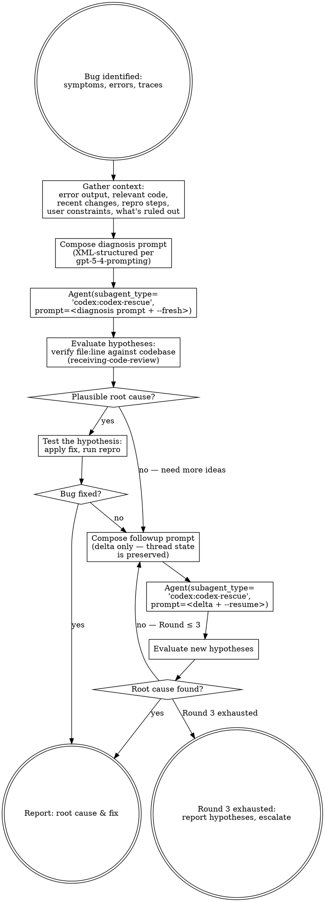

# Codex Debugger

## Overview

Use the Codex Claude Code plugin's **`codex:codex-rescue` subagent** to get an independent debugging perspective on a specific bug, then iterate until root cause is identified and a fix is confirmed.

**Core principle:** A fresh pair of eyes catches what you miss. When you're stuck on a bug, dispatch Codex the full context — symptoms, traces, relevant code, what you've ruled out, user constraints — and collaborate on hypotheses until the root cause is found.

**Why the `codex:codex-rescue` subagent:** The plugin exposes `task` (Codex's general-purpose mode) through the `codex:codex-rescue` subagent as a thin forwarder. Dispatching via the Agent tool gets Codex thread continuity (`--resume` / `--fresh`), consistent error handling, and the plugin's `gpt-5-4-prompting` scaffolding — without the skill needing to resolve plugin paths or manage sessions.

## When to Use

- When stuck on a bug after initial investigation
- When a test failure has a non-obvious root cause
- When you want a second opinion on a debugging hypothesis
- When error messages or stack traces point to unfamiliar code paths

## The Process



## Step-by-Step

### Step 1: Verify plugin is ready — and treat empty output as failure

If the plugin is not installed or Codex isn't authenticated, tell the user to run `/codex:setup`.

**Critical:** The `codex:codex-rescue` subagent contract says *"If the Bash call fails or Codex cannot be invoked, return nothing."* It does **not** surface an error — it returns an empty response. Never try to evaluate an empty response as a diagnosis.

**Empty-response differential — do not default to "setup/auth":**

| Which round | What empty output usually means | Recovery |
|-------------|----------------------------------|----------|
| Round 1 with `--fresh` | Plugin missing, Codex not authenticated, or runtime broken | Stop. Ask user to run `/codex:setup`. |
| Round 2+ with `--resume` | No resumable thread for this workspace (e.g., prior task expired), or the prior task is still running | Stop. Check state via `node "$CODEX_COMPANION" status --json` or `/codex:status`. If no resumable thread, retry the round with `--fresh` and re-include the full original context. If prior task is still running, wait for it or cancel via `/codex:cancel`. |
| Any round after a transient Bash/runtime error | Hard failure in the invocation | Stop. Surface to user; do NOT silently retry in a loop. |

Do not default to `/codex:setup` remediation on every empty response — it misroutes resume-state failures.

Optional preflight: resolve the companion path and run a cheap status check before dispatching:

```bash
CODEX_COMPANION="$(ls -d ~/.claude/plugins/cache/openai-codex/codex/*/scripts/codex-companion.mjs 2>/dev/null | sort -V | tail -1)"
[ -z "$CODEX_COMPANION" ] && { echo "Codex plugin not installed; run /codex:setup"; exit 1; }
# status returns quickly and exits non-zero if the plugin runtime is broken
node "$CODEX_COMPANION" status --json >/dev/null 2>&1 || { echo "Codex runtime unreachable; run /codex:setup"; exit 1; }
```

Note: `status` only verifies plugin reachability, not Codex auth — auth failures still manifest as empty subagent output, which Step 4's empty-response rule handles.

### Step 2: Gather bug context

Debugging needs MORE context than reviewing — err on the side of too much.

```bash
# 1. Error output / stack trace / test failure — capture EXACT, unmodified

# 2. Relevant source code — Read each file in the stack trace / error

# 3. Recent changes (possible regression)
git status
git log --oneline -10
git diff HEAD
git diff --cached
# If comparing against a base branch:
git diff main...HEAD

# 4. git blame on the failing lines (when was it last changed?)
git blame -L <start>,<end> <file>
```

**Also gather (Codex can't know these from the repo):**
- What's expected vs what's happening
- Reproduction steps (exact command, test, or user action)
- What you've already tried and ruled out (prevents Codex from re-suggesting)
- Any relevant configuration or environment details
- **User constraints:** hot-path no-allocation rules, backward-compat, deadline pressure
- **User's specific requests:** "focus on concurrency", "ignore the logging for now"

### Step 3: Compose the diagnostic prompt (Round 1)

Follow `gpt-5-4-prompting`: XML-tagged blocks, one clear task, explicit output contract. The prompt below is a starting template — trim anything that doesn't apply:

```xml
<task>
Diagnose the root cause of the following bug in this repository. The code is at the current HEAD state with the changes described below.
</task>

<bug>
  <expected>[What should happen]</expected>
  <actual>[What is happening — paste exact error / stack trace verbatim]</actual>
  <repro>[Exact command or steps to reproduce]</repro>
</bug>

<relevant_code>
  [File paths with line ranges; small snippets if pasting is cheaper than re-reading]
  [If Codex needs to explore, list the starting points]
</relevant_code>

<recent_changes>
  [Paste relevant diff or list of commits — "git log --oneline" output is often enough]
</recent_changes>

<what_was_ruled_out>
  - [Hypothesis tested and why it's not the cause]
  - [Configuration checked]
</what_was_ruled_out>

<user_constraints>
  - [e.g., "hot path — no allocations allowed"]
  - [e.g., "must stay compatible with v3 wire format"]
</user_constraints>

<specific_requests>
  [User-flagged focus areas, if any]
</specific_requests>

<compact_output_contract>
Return:
1. Ranked list of hypotheses (most likely first)
2. For each: the specific code path that would cause this, with file:line references
3. Diagnostic steps to confirm/reject each hypothesis
4. Proposed fix for the most likely root cause
</compact_output_contract>

<default_follow_through_policy>
Keep going until you have enough evidence to identify the root cause confidently. Only stop to ask when a missing detail changes correctness materially.
</default_follow_through_policy>

<verification_loop>
Before finalizing, verify each hypothesis's code path matches the observed evidence (stack trace, error message, repro).
</verification_loop>

<missing_context_gating>
Do not guess missing repository facts. If required context is absent, state exactly what remains unknown.
</missing_context_gating>

<grounding_rules>
Every hypothesis must cite specific file:line references in the actual repository. Do not invent code paths.
</grounding_rules>
```

### Step 4: Dispatch via the Agent tool (Round 1)

```
Agent(
  description="Codex diagnosis round 1",
  subagent_type="codex:codex-rescue",
  prompt="""
<the XML prompt from Step 3>

--wait --fresh
"""
)
```

**Routing flags — `--wait` is mandatory for diagnostic rounds:**

| Flag | Effect |
|------|--------|
| `--wait` | **Required.** Forces the rescue subagent to run Codex in the foreground and return the full diagnosis. Without this, the subagent is allowed to background "complicated, open-ended" prompts — a big debugging prompt with traces and code qualifies — and the subagent would return a launch/status response instead of a diagnosis. Step 5 would then try to evaluate that non-diagnosis, breaking the workflow. |
| `--fresh` | Start a new Codex thread (Round 1 default) |
| `--resume` | Continue the prior Codex thread (Round 2+ default) |
| (no `--write`) | Read-only — diagnosis only, no file edits by Codex |

**Do not add `--write`** — the debugger skill is diagnostic. Claude applies the fix after evaluating hypotheses.

The subagent returns Codex's final message verbatim. **If the returned message is empty**, stop and consult the empty-response differential in Step 1 — the correct remediation depends on which round/routing you were on (`--fresh` → likely setup/auth; `--resume` → more likely a missing thread or in-flight task).

### Step 5: Evaluate hypotheses (receiving-code-review)

Apply `superpowers:receiving-code-review` discipline:

1. **VERIFY** — Does the cited file:line exist? Read it. Does the code path match Codex's claim?
2. **TEST** — Can you confirm or reject the hypothesis?
   - Read the referenced code to check if the logic matches Codex's claim
   - If Codex suggests a diagnostic step (add a log, inspect a value), try it
   - Run the reproduction steps after applying a targeted fix
3. **CATEGORIZE:**
   - **Confirmed:** evidence supports — apply fix
   - **Rejected:** evidence contradicts — note why
   - **Plausible:** can't confirm yet — needs investigation
4. **Apply the most promising fix** and run repro.

**No performative agreement.** Codex works from limited context and will make wrong claims. If a hypothesis is inconsistent with the code you can read, reject it and say why.

### Step 6: Round 2 — use `--resume` for thread continuity

If the bug persists, dispatch a follow-up. Because the rescue subagent supports `--resume` (which maps to Codex's `--resume-last`), you send only the *delta* — no need to restate full context:

```
Agent(
  description="Codex diagnosis round 2",
  subagent_type="codex:codex-rescue",
  prompt="""
<round_1_outcome>
  <hypotheses_tested>
    - [Hypothesis 1]: confirmed/rejected — [evidence]
    - [Hypothesis 2]: confirmed/rejected — [evidence]
  </hypotheses_tested>
  <new_observations>
    - [New evidence from diagnostic steps]
    - [Values observed, logs captured]
  </new_observations>
  <additional_code_context>
    [Any new code paths discovered since Round 1]
  </additional_code_context>
</round_1_outcome>

<next_step>
Revise your hypotheses. Consider less obvious causes: initialization order, concurrency, configuration differences, environment-dependent behavior.
</next_step>

--wait --resume
"""
)
```

Always include `--wait` (see Step 4) — even resume-mode rounds can be classified "complicated" by the subagent and backgrounded otherwise.

If you choose to start fresh instead (e.g., the direction changed materially), use `--wait --fresh` and re-include the full context.

### Step 7: Iterate or escalate

Continue until:

- **Root cause confirmed:** fix applied and repro passes
- **Round 3 reached:** diminishing returns — compile findings and escalate to user with all hypotheses tested

Each round should **narrow scope** — eliminate hypotheses, add new evidence, focus on remaining possibilities.

### Step 8: Report to User

```markdown
## Codex Debugging Summary

### Bug
[One-line description]

### Root Cause
[What was actually wrong, with file:line]

### Fix Applied
[What was changed and why]

### Hypotheses Tested
- [H1]: confirmed/rejected — [evidence]
- [H2]: confirmed/rejected — [evidence]

### Rounds: N / 3
### Final Status: [root cause found / escalated]

### Remaining Unknowns (if escalated)
- [What hasn't been ruled out]
- [Suggested next steps]
```

## What to include in the prompt — and what NOT to

**INCLUDE** (Codex cannot infer):
- Exact error messages / stack traces (verbatim)
- Expected vs actual behavior
- Reproduction steps
- What's been ruled out (and why)
- User constraints (hot path, back-compat, deadlines)
- Specific user-flagged focus areas

**DO NOT INCLUDE in Round 2+ with `--resume`**:
- Full original context — the thread remembers it
- Just send the delta (new evidence, revised question)

**NEVER INCLUDE**:
- Paraphrased error messages — always verbatim
- Solutions you want Codex to agree with — biases the analysis
- "Please be thorough" — the prompt contract does that already

## Common Mistakes

| Mistake | Fix |
|---------|-----|
| Omitting `--wait` from the Agent prompt | Subagent can background "complicated" prompts and return a launch/status response instead of the diagnosis — Step 5 then evaluates the wrong thing. Always include `--wait` |
| Treating empty subagent output as "no findings" | Empty = Codex invocation failure. Stop the loop and consult the empty-response differential in Step 1 — remediation differs by `--fresh` vs `--resume` |
| Routing every empty response to `/codex:setup` | `--resume` rounds return empty for non-auth reasons (no resumable thread, prior task still running). Use `/codex:status` or retry with `--fresh` for resume-state failures |
| Dispatching without a verbatim error trace | Always paste exact, unmodified output |
| Omitting `<what_was_ruled_out>` | Codex will suggest things you've already tried |
| Not providing `<user_constraints>` | Codex may suggest fixes that violate hot-path / back-compat rules |
| Using `--fresh` for Round 2 | Use `--resume` — Codex keeps thread state; saves context re-send |
| Restating full context on `--resume` rounds | Thread remembers it — send only the delta |
| Accepting a hypothesis without verifying file:line | Codex invents code paths under limited context — always Read and verify |
| Adding `--write` to the rescue prompt | Debugger is diagnostic; Claude applies fixes |
| Paraphrasing error messages | Always verbatim |
| Endless iteration (4+ rounds) | Cap at 3; escalate with full hypothesis log |
| Not running repro after applying a fix | Always test against the original reproduction steps |

## Quick Reference

| Action | How |
|--------|-----|
| Round 1 diagnosis | `Agent(subagent_type="codex:codex-rescue", prompt="<xml_prompt>\n\n--wait --fresh")` |
| Round 2 follow-up | `Agent(subagent_type="codex:codex-rescue", prompt="<delta_xml>\n\n--wait --resume")` |
| Empty subagent output | Treat as Codex invocation failure. Consult Step 1 differential: `--fresh` → `/codex:setup`; `--resume` → `/codex:status` or retry with `--fresh` |
| Check plugin / auth | User runs `/codex:setup` |
| Prompt recipe reference | See the plugin's `skills/gpt-5-4-prompting` and its `references/codex-prompt-recipes.md` |
