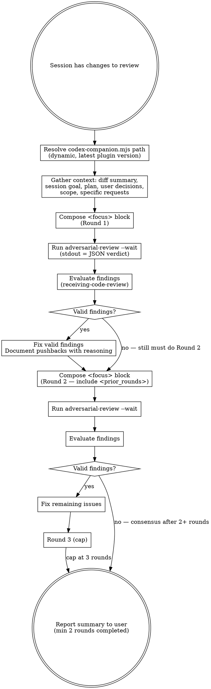

# Codex Reviewer

## Overview

Use the Codex Claude Code plugin's **adversarial-review** to get an independent, skeptical code review of your session changes, then iterate until consensus.

**Core principle:** Two AI reviewers catch more than one. Codex's `adversarial-review` is designed to break confidence in a change — it ships with a skeptical prompt template, attack-surface priorities, and a structured JSON verdict. Your job is to feed it *detailed context* (goal, plan, user decisions, scope, specific requests), evaluate findings with technical rigor (`superpowers:receiving-code-review`), fix what's valid, push back on what's wrong, and iterate until agreement.

**Minimum 2 rounds — mandatory.** Even if Round 1 returns `approve` with zero findings, you MUST run Round 2 with fresh eyes. A clean Round 1 is not proof — it may mean the reviewer was too shallow. Never short-circuit to "no issues found" after a single round. Cap at 3.

**Always use `adversarial-review`**, not plain `review` — the project policy is that every reviewer pass should default to skepticism.

## When to Use

- After completing implementation work and before reporting back to user
- When user asks for a Codex review of changes
- Before creating PRs or merging significant work
- When you want a second opinion on your approach

## What the plugin provides (so the skill doesn't duplicate it)

The plugin's `adversarial-review` prompt already bakes in:
- Skeptical role / operating stance ("default to skepticism")
- Attack-surface priorities (auth, data loss, race conditions, rollback, version skew, observability)
- Finding bar (material findings only, no style/naming)
- Structured JSON output contract (verdict, findings with file/line/confidence/recommendation)
- Grounding rules (every finding must be defensible from repo context)
- Calibration rules (prefer one strong finding over many weak ones)

**Do NOT restate any of the above in your focus text.** The focus text is a scarce channel — spend it on context Codex cannot derive from the repo.

## The Process



## Step-by-Step

### Step 1: Resolve the Codex companion script

The plugin exports `CLAUDE_PLUGIN_ROOT` only for its own commands/agents — **not for skill Bash contexts**. Resolve the latest installed version dynamically:

```bash
CODEX_COMPANION="$(ls -d ~/.claude/plugins/cache/openai-codex/codex/*/scripts/codex-companion.mjs 2>/dev/null | sort -V | tail -1)"
[ -z "$CODEX_COMPANION" ] && { echo "Codex plugin not installed; see /codex:setup"; exit 1; }
```

Run `/codex:setup` (user-invoked) if the plugin isn't present or Codex isn't authenticated.

### Step 2: Must run inside the target Git repo

`adversarial-review` requires a Git repository. `cd` into the repo being reviewed before invoking (e.g., `cd ~/src/qr`, not `~/src`).

### Step 3: Gather context

Collect everything Codex needs that it cannot derive from the repo:

- **Session goal:** what was being built and why
- **Plan / requirements:** the doc or ticket being fulfilled
- **User decisions & constraints:** explicit choices already made by the user (hot-path constraints, backward-compat, deadlines, architectural boundaries) — *Codex cannot know these from the diff*
- **Review scope:**
  - *In scope:* files / areas / behaviors to focus on
  - *Out of scope:* deferred work, intentionally excluded paths, unchanged regions
- **Specific requests:** concerns the user flagged (e.g., "verify migration is reversible", "check concurrency in the write path")

Also inspect the repo state:

```bash
git status --short --untracked-files=all
git diff --shortstat
git diff --shortstat --cached
git log --oneline -5
```

Use this to pick the scope flag (see Step 4).

### Step 4: Choose scope

| Situation | Flag |
|-----------|------|
| Reviewing uncommitted work (staged + unstaged + untracked) | `--scope working-tree` |
| Reviewing commits on the current branch vs a base | `--scope branch --base <ref>` (e.g., `--base main`) |
| Let the plugin decide from repo state | `--scope auto` (default) |

`--scope staged` and `--scope unstaged` are **not supported** by adversarial-review.

### Step 5: Compose the `<focus>` block (Round 1)

This block is the entire `{{USER_FOCUS}}` delivered to Codex. Keep it tight and structured:

```xml
<session_goal>
  [One-paragraph summary of what was built and why]
</session_goal>

<plan>
  [Reference to the plan/spec or inline summary of requirements]
</plan>

<user_decisions>
  - [Decision and rationale, e.g., "chose synchronous fsync because the caller expects durability"]
  - [Constraint, e.g., "this code is on the HFT hot path — no allocations, no lock contention"]
  - [Boundary, e.g., "must stay API-compatible with v3 clients"]
</user_decisions>

<review_scope>
  <in_scope>
    - [File / area / behavior 1]
    - [File / area / behavior 2]
  </in_scope>
  <out_of_scope>
    - [What's deferred or intentionally excluded, with reason]
  </out_of_scope>
</review_scope>

<specific_requests>
  - [User-flagged concern 1, e.g., "concurrent access under partial failure"]
  - [User-flagged concern 2, e.g., "schema-migration rollback safety"]
</specific_requests>

<round>1</round>
```

### Step 6: Run adversarial-review (Round 1)

```bash
cd <target-repo>

FOCUS="$(cat <<'EOF'
<session_goal>...</session_goal>
<plan>...</plan>
<user_decisions>...</user_decisions>
<review_scope>...</review_scope>
<specific_requests>...</specific_requests>
<round>1</round>
EOF
)"

node "$CODEX_COMPANION" adversarial-review \
  --wait \
  --scope working-tree \
  "$FOCUS"
```

- `--wait` keeps it foreground so you can read stdout directly in the next tool call. Always use `--wait` for iterative review — you need the verdict to evaluate before the next round.
- stdout = human-readable markdown report (target, verdict, findings with severity, recommendations, next steps). The underlying data is JSON (per `review-output.schema.json`) but the companion script renders to markdown by default.
- stderr = progress stream (ignorable).
- **Do not use `--background` with a direct companion-script call.** The plugin's detached-execution path is owned by the `/codex:adversarial-review` slash command, which wraps the call in `Bash(..., run_in_background: true)`. The companion script's own `--background` flag does not reliably detach when invoked directly from a skill.
- **If a review is too large for `--wait`**, ask the user to run the slash command manually and **paste the same `$FOCUS` block as trailing focus text** — `/codex:adversarial-review` accepts focus text after the flags, unlike `/codex:review`. The skill-constructed focus block (session_goal, user_decisions, review_scope, specific_requests) carries context Codex cannot derive from git; dropping it for the large-review path would produce materially weaker findings. Format for the user to copy:
  ```
  /codex:adversarial-review --background --scope <scope> [--base <ref>]
  <paste the entire $FOCUS XML block here>
  ```
  Then the user polls `/codex:status`, and when done fetches `/codex:result <job-id>` — hand the result back to Claude to evaluate with `receiving-code-review`.

### Step 7: Read and evaluate findings (receiving-code-review)

Apply `superpowers:receiving-code-review` to every finding:

1. **VERIFY** against the actual codebase — is the file/line correct? Does the code path exist as Codex claims?
2. **EVALUATE** — does this apply to this codebase and context (given the `<user_decisions>` and `<review_scope>`)?
3. **CATEGORIZE:**
   - **Accept:** technically correct → fix
   - **Push back:** Codex lacks context or is wrong → document why
   - **Defer:** valid but out of scope → note for user
4. **Implement** accepted fixes.

**No performative agreement.** If Codex is wrong, say why and move on.

**Regardless of whether Round 1 found issues, proceed to Round 2.**

### Step 8: Round 2 — MANDATORY

Re-run adversarial-review with an updated `<focus>` block that adds `<prior_rounds>`:

```xml
<session_goal>...</session_goal>
<plan>...</plan>
<user_decisions>...</user_decisions>
<review_scope>...</review_scope>
<specific_requests>...</specific_requests>
<round>2</round>

<prior_rounds>
  <round_1>
    <findings_accepted>
      - [Finding]: [What was fixed and where]
    </findings_accepted>
    <findings_pushed_back>
      - [Finding]: [Why it was rejected — cite code or decision]
    </findings_pushed_back>
    <findings_deferred>
      - [Finding]: [Why deferred]
    </findings_deferred>
    <instruction_to_reviewer>
      Reassess with fresh eyes. [If Round 1 was clean: "Round 1 found no issues — look deeper for subtle logic errors, missing edge cases, concurrency, or convention violations."]
      [If Round 1 had fixes: "Verify the fixes are correct and complete, and flag any regressions they introduced."]
    </instruction_to_reviewer>
  </round_1>
</prior_rounds>
```

Invoke the same `node "$CODEX_COMPANION" adversarial-review --wait ...` command.

**Scope-aware rerun — critical:**
- `--scope working-tree`: fixes are automatically included on rerun — the plugin re-reads the working-tree diff each call, so uncommitted fixes are visible immediately. Use this for iterative rounds when Round 1 also used working-tree.
- `--scope branch --base <ref>`: the plugin diffs `<base>...HEAD`, which means uncommitted fixes are **invisible**. Before a branch-scope rerun, you MUST commit (or `git commit --amend`) your fixes.
- `--scope auto`: the plugin chooses based on repo state; when iterating with uncommitted fixes, prefer explicit `--scope working-tree` to avoid surprises.

**MANDATORY: the confirmation pass must use the same scope as Round 1.** If Round 1 used `--scope branch --base <ref>`, then:
1. Commit your fixes (or amend).
2. **Round 2 (confirmation pass) MUST also use `--scope branch --base <ref>`.** Switching permanently to `--scope working-tree` for Round 2 narrows the review to only the changed files and leaves the rest of the branch untested post-fix. That can reach a spurious `approve` while branch-level interactions in untouched files remain unreviewed.
3. You MAY run an *extra* interim `--scope working-tree` pass purely as fix-validation (fast feedback before you commit), but it does **not** count as the mandatory Round 2. The mandatory confirmation pass is the branch-scope rerun on committed code.

If Round 1 used `--scope working-tree`, Round 2 also uses `--scope working-tree`. Do not mix scopes across the mandatory 2-round minimum.

### Step 9: Iterate — Round 3 cap

Evaluate Round 2 findings with `receiving-code-review`. If more valid findings emerge, fix and run Round 3 with the same template (add `<round_2>` under `<prior_rounds>`). Stop when:

- Codex returns `approve` after a round where you made fixes, OR
- You and Codex reach technical consensus (agree or agree-to-disagree with reasoning), OR
- You hit Round 3 (diminishing returns — escalate remaining disagreements to the user)

### Step 10: Report to User

```markdown
## Codex Adversarial Review Summary

### Issues Identified & Resolved
- [Finding]: [What was wrong] → [What was fixed]

### Pushback (Codex suggestion rejected)
- [Suggestion]: [Why it was rejected — cite code/decision]

### Deferred Items
- [Item]: [Why deferred, recommendation]

### Rounds: N / 3
### Final Verdict: [approve / needs-attention] (Codex) — [consensus / escalated items below]

### Remaining Disagreements (if any)
- [Topic]: Claude's position vs Codex's position — user decision needed
```

## The `<focus>` block — what to include and what NOT to include

**INCLUDE** (Codex cannot derive this from the repo):
- Session goal and motivation
- Plan / requirements
- User decisions, rationale, and constraints
- Explicit in-scope / out-of-scope boundaries
- User-flagged concerns
- Round number and prior-round summary (after Round 1)

**DO NOT INCLUDE** (the plugin's prompt already does this):
- "Be skeptical", "be adversarial", "look for bugs" — baked in
- Attack surfaces to check — baked in
- Output format requirements — baked in
- Grounding / calibration rules — baked in
- The diff itself — plugin pulls it from git state

## Common Mistakes

| Mistake | Fix |
|---------|-----|
| Using plain `review` instead of `adversarial-review` | Project policy: reviewer always uses adversarial-review |
| Skipping Round 2 after clean Round 1 | MANDATORY — a clean Round 1 may be a shallow Round 1 |
| Skipping Round 2 after fixing Round 1 issues | MANDATORY — fixes may introduce new issues |
| Sending a focus block that re-states the review prompt | Focus block is for user-specific context ONLY |
| Not providing `<user_decisions>` | Codex will flag intentional design choices as bugs without it |
| Not providing `<review_scope>` | Codex will surface out-of-scope concerns that dilute the signal |
| Hardcoding the plugin path | Use dynamic resolution; versions bump |
| Running from outside the target git repo | `cd` into the repo first — adversarial-review requires git |
| Endless iteration (4+ rounds) | Cap at 3; escalate remaining disagreements to user |
| Accepting all findings without verification | Every finding: verify file/line and code path before acting |
| Running `--background` for interactive iteration | Use `--wait` so stdout returns the verdict to read immediately |
| Using direct script `--background` for large reviews | Direct companion-script `--background` does not reliably detach; the slash command owns detachment. Ask the user to run `/codex:adversarial-review --background` instead |
| Using `--scope branch` with uncommitted fixes in the mandatory rerun | Branch scope diffs `<base>...HEAD` — uncommitted changes are invisible. **Commit or `git commit --amend` before the rerun, then re-run with the same `--scope branch --base <ref>`.** Do NOT switch to `--scope working-tree` for the mandatory confirmation pass — that narrows the review to only the changed files and can miss branch-level issues in untouched files (spurious `approve`). A working-tree pass is acceptable only as an extra interim fix-validation check; the mandatory Round 2 still has to use the same scope as Round 1 |
| Assuming stdout is JSON | Companion renders markdown by default; underlying schema is JSON but the Markdown report is what `--wait` prints |

## Quick Reference

| Action | Command |
|--------|---------|
| Resolve companion path | `CODEX_COMPANION="$(ls -d ~/.claude/plugins/cache/openai-codex/codex/*/scripts/codex-companion.mjs \| sort -V \| tail -1)"` |
| Review working-tree changes | `node "$CODEX_COMPANION" adversarial-review --wait --scope working-tree "$FOCUS"` |
| Review branch vs base | `node "$CODEX_COMPANION" adversarial-review --wait --scope branch --base main "$FOCUS"` |
| Fetch a background job's result (if one exists) | `node "$CODEX_COMPANION" result <job-id>` — primarily for results started via `/codex:adversarial-review --background` |
| Large review that can't complete with `--wait` | Ask user to run `/codex:adversarial-review --background` — do not use direct-script `--background` |
| Check plugin / auth | User runs `/codex:setup` |
