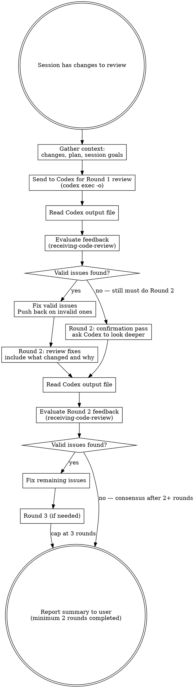

# Codex Reviewer

## Overview

Use OpenAI Codex CLI to get an independent code review of your session changes, then iterate until consensus.

**Core principle:** Two AI reviewers catch more than one. Get Codex's perspective, evaluate it with technical rigor (receiving-code-review), fix what's valid, push back on what's wrong, and iterate until you agree.

**Minimum 2 rounds — mandatory.** Even if Round 1 finds zero issues, you MUST send a Round 2 confirmation pass. A clean Round 1 is not proof of correctness — it may mean the reviewer was too shallow. Round 2 forces a deeper second look. Never short-circuit to "no issues found" after a single round.

## When to Use

- After completing implementation work and before reporting back to user
- When user asks for a Codex review of changes
- Before creating PRs or merging significant work
- When you want a second opinion on your approach

## The Process



## Step-by-Step

### Step 1: Gather Context

Collect everything Codex needs for a meaningful review:

```bash
# Get the diff of all changes
git diff HEAD
git diff --cached
git status

# If working against a branch
git diff main...HEAD
```

Also gather:
- What was the goal/plan for the session
- What files were changed and why
- Any architectural decisions made

### Step 2: Send to Codex (Round 1)

Use `codex exec` with `-o` (`--output-last-message`) to write the final review to a file you can read back. Codex streams progress to stderr; the final agent message goes to stdout and the `-o` file.

**Important:** Do NOT use `codex review` with stdout redirection — it uses a TUI that doesn't produce output when piped. Always use `codex exec -o`.

```bash
# Generate a unique output file per round
REVIEW_FILE="/tmp/codex-review-$(date +%s)-r1.md"

# For code changes — capture diff and send with context
DIFF=$(git diff HEAD && git diff --cached)
codex exec \
  --skip-git-repo-check \
  --sandbox read-only \
  -o "$REVIEW_FILE" \
  "You are a code reviewer. Review the following diff for: correctness, bugs, security, edge cases, architecture. Be specific with file:line references. Categorize issues as Critical/Important/Minor.

Context: {WHAT_WAS_DONE_AND_WHY}
Plan/Requirements: {PLAN_OR_REQUIREMENTS}

Diff:
$DIFF"
```

**For plan/config files** — read the file content into the prompt:

```bash
CONTENT=$(cat plan.md)
codex exec \
  --skip-git-repo-check \
  --sandbox read-only \
  -o "$REVIEW_FILE" \
  "Review this project plan for completeness, risks, and gaps. Be specific.

Plan:
$CONTENT"
```

**Security notes:**
- Always use `--sandbox read-only` for reviews (Codex doesn't need write access)
- Never use `--dangerously-bypass-approvals-and-sandbox` for review tasks
- Review the output file before acting on it

**Always include in the prompt:**
- What was implemented and why
- The plan or requirements being fulfilled
- Any constraints or decisions already made
- Request for specific file:line references

### Step 3: Read and Evaluate Feedback (receiving-code-review)

Read the output file, then apply `superpowers:receiving-code-review` to evaluate Codex's feedback.

For each piece of feedback:

1. **VERIFY** against the actual codebase — is Codex correct?
2. **EVALUATE** — does this apply to THIS codebase and context?
3. **CATEGORIZE:**
   - **Accept:** Technically correct, fix it
   - **Push back:** Codex is wrong or lacks context — note why
   - **Defer:** Valid but out of scope — note for user
4. **Implement** accepted fixes

**No performative agreement.** If Codex is wrong, say why and move on.

**Regardless of whether Round 1 found issues, proceed to Round 2.** Do NOT stop here.

### Step 4: Round 2 — MANDATORY (always required)

Round 2 is always required, even if Round 1 found zero issues. Choose the appropriate variant:

**Variant A — Round 1 found issues (review fixes):**

After fixing valid issues, send Codex the updated state with full context of what changed:

```bash
REVIEW_FILE_R2="/tmp/codex-review-$(date +%s)-r2.md"
DIFF_R2=$(git diff HEAD && git diff --cached)

codex exec \
  --skip-git-repo-check \
  --sandbox read-only \
  -o "$REVIEW_FILE_R2" \
  "Round 2 code review.

Previous issues identified and actions taken:
{SUMMARY_OF_ROUND_1_ISSUES_AND_FIXES}

I pushed back on these items (with reasoning):
{PUSHBACK_ITEMS_WITH_REASONING}

Please review my fixes and pushback reasoning. Flag any remaining concerns.

Updated diff:
$DIFF_R2"
```

**Variant B — Round 1 found no issues (confirmation pass):**

A clean Round 1 does not mean the code is clean — it may mean the first pass was too shallow. Send a confirmation pass with a different angle:

```bash
REVIEW_FILE_R2="/tmp/codex-review-$(date +%s)-r2.md"
DIFF_R2=$(git diff HEAD && git diff --cached)

codex exec \
  --skip-git-repo-check \
  --sandbox read-only \
  -o "$REVIEW_FILE_R2" \
  "Round 2 confirmation pass. Your Round 1 review found no issues. Please look again more carefully with fresh eyes.

Specifically check for:
- Subtle logic errors or off-by-one mistakes
- Missing edge cases or error handling gaps
- Concurrency or state management issues
- Security concerns (injection, auth, data exposure)
- Performance problems under load
- Violations of the project's conventions or architecture

Context: {WHAT_WAS_DONE_AND_WHY}
Plan/Requirements: {PLAN_OR_REQUIREMENTS}

Diff:
$DIFF_R2"
```

### Step 5: Evaluate Round 2 and Iterate

Read the Round 2 output file and apply `receiving-code-review` again. If new valid issues surface, fix and send Round 3. Continue until:

- Codex confirms fixes are good (after minimum 2 rounds), OR
- You and Codex reach technical consensus (agree or agree-to-disagree with reasoning), OR
- Maximum 3 rounds (diminishing returns — escalate remaining disagreements to user)

**The earliest you may stop and report to the user is after completing Round 2 evaluation.**

### Step 6: Report to User

Provide a structured summary:

```markdown
## Codex Review Summary

### Issues Identified & Resolved
- [Issue]: [What was wrong] → [What was fixed]

### Pushback (Codex suggestion rejected)
- [Suggestion]: [Why it was rejected]

### Deferred Items
- [Item]: [Why deferred, recommendation]

### Rounds: N
### Final Status: Consensus reached / Escalated items below

### Remaining Disagreements (if any)
- [Topic]: Claude's position vs Codex's position — user decision needed
```

## Common Mistakes

| Mistake | Fix |
|---------|-----|
| Accepting all Codex feedback blindly | Verify each item against codebase reality |
| Sending diff without context | Always include what/why/plan |
| Skipping Round 2 after clean Round 1 | Round 2 is MANDATORY — a clean Round 1 may be a shallow Round 1. Always send a confirmation pass |
| Skipping Round 2 after fixing Round 1 issues | Round 2 is MANDATORY — fixes may introduce new issues. Always send fixes back for re-review |
| Endless iteration (4+ rounds) | Cap at 3 rounds, escalate disagreements to user |
| Not reporting pushback items | User needs to know what was rejected and why |
| Using interactive codex or `codex review` piped | Always use `codex exec --skip-git-repo-check --sandbox read-only -o` — `codex review` doesn't output when piped |
| Using writable sandbox for reviews | Always use `--sandbox read-only` — reviewer needs no write access |
| Not reading the output file | Codex writes to the `-o` file; you must Read it to see the feedback |

## Quick Reference

| Action | Command |
|--------|---------|
| Review code changes | `codex exec --skip-git-repo-check --sandbox read-only -o /tmp/codex-review-r1.md "Review this diff: $DIFF"` |
| Review plan/config file | `codex exec --skip-git-repo-check --sandbox read-only -o /tmp/codex-review-r1.md "Review this plan: $CONTENT"` |
| Machine-readable output | `codex exec --skip-git-repo-check --json --sandbox read-only -o /tmp/review.md "..."` |
| Read review results | Use Read tool on the `-o` output file |
