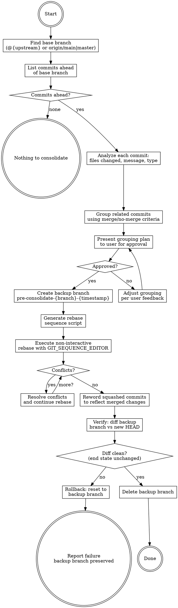

# Consolidate Commits

## Overview

Analyze commits ahead of the remote base branch, group related ones, and rebase them into clean, well-worded commits using non-interactive `git rebase` with `GIT_SEQUENCE_EDITOR`.

**Core principle:** Related work belongs in one commit. Unrelated work stays separate.

**Announce at start:** "I'm using the consolidate-commits skill to clean up the commit history on this branch."

## The Process



## Step-by-Step

### Step 0: Safety Checks

Before anything, ensure the working tree is clean and no git operation is in progress:

```bash
git status --porcelain
```

If there are uncommitted changes, **stop and ask the user** to commit or stash them first. A rebase on a dirty tree is dangerous.

Also check for in-progress git operations that would conflict:

```bash
# Check for active rebase, merge, cherry-pick, or bisect
if [ -d "$(git rev-parse --git-dir)/rebase-merge" ] || \
   [ -d "$(git rev-parse --git-dir)/rebase-apply" ] || \
   [ -f "$(git rev-parse --git-dir)/MERGE_HEAD" ] || \
   [ -f "$(git rev-parse --git-dir)/CHERRY_PICK_HEAD" ] || \
   [ -f "$(git rev-parse --git-dir)/BISECT_LOG" ]; then
    echo "ERROR: Another git operation is in progress. Resolve it first."
fi
```

If any in-progress operation is detected, **STOP IMMEDIATELY and tell the user** to finish or abort it first. Do NOT proceed to any further steps.

**Do NOT create the backup branch yet.** That happens in Step 5, right before the rebase executes and after the user approves the plan. This avoids creating throwaway branches if the user cancels or there's nothing to consolidate.

### Step 1: Find the Base Branch and List Commits

Determine which remote branch to compare against. Use the branch's configured upstream first, then fall back to common defaults:

```bash
# 1. Try the branch's own upstream tracking ref
BASE_BRANCH=$(git rev-parse --abbrev-ref --symbolic-full-name @{upstream} 2>/dev/null)

# 2. Fall back to origin/main or origin/master
if [ -z "$BASE_BRANCH" ]; then
    if git rev-parse --verify origin/main >/dev/null 2>&1; then
        BASE_BRANCH="origin/main"
    elif git rev-parse --verify origin/master >/dev/null 2>&1; then
        BASE_BRANCH="origin/master"
    else
        echo "ERROR: No upstream set and neither origin/main nor origin/master found"
        # STOP and ask user which base branch to use. Do NOT proceed without a valid base.
    fi
fi
```

**Important:** Ensure remote refs are reasonably current. If the last fetch was long ago, warn the user: "Remote refs may be stale — consider running `git fetch` first." Do NOT auto-fetch without asking.

List all commits ahead of the base:

```bash
git log --oneline --reverse $BASE_BRANCH..HEAD
```

If there are 0 or 1 commits, report "Nothing to consolidate" and stop.

### Step 2: Analyze Each Commit

For every commit ahead of base, gather:

```bash
# For each commit SHA
git log -1 --format="%H %s" $SHA
git diff-tree --no-commit-id --name-only -r $SHA
git show --stat $SHA
```

Build a mental model of each commit:
- **Type:** feature, bugfix, refactor, test, docs, config, plan
- **Scope:** which module/component it touches
- **Files changed:** exact file list
- **Relationship:** does it relate to other commits?

### Step 3: Group Commits Using Merge Criteria

#### MERGE these commits together (squash into one):

| Criteria | Example |
|----------|---------|
| Sub-modules of the same feature | `feat: add parser` + `feat: add parser validation` |
| Different files for a single bugfix | `fix: null check in auth` + `fix: handle auth timeout` (same bug) |
| Test files + the feature they cover | `feat: add export` + `test: add export tests` |
| Feature impl + its design/plan doc | `feat: add caching` + `docs: caching impl plan` |

#### Do NOT merge these (keep as separate commits):

| Criteria | Example |
|----------|---------|
| Refactor vs new feature | `refactor: extract helper` should stay separate from `feat: add search` |
| Two unrelated bugfixes | `fix: login timeout` and `fix: CSV encoding` stay separate |
| Config changes vs code changes | `chore: update eslint` stays separate from `feat: add validation` |

### Step 4: Present the Plan to the User

Before executing, present the grouping plan clearly:

```
Proposed commit consolidation:

Group 1 (squash): "feat(auth): implement OAuth2 login flow"
  - abc1234 feat: add OAuth2 provider config
  - def5678 feat: add OAuth2 callback handler
  - 789abcd test: add OAuth2 integration tests
  - aaa1111 docs: OAuth2 implementation plan

Group 2 (keep as-is): "refactor(utils): extract date formatting helpers"
  - bbb2222 refactor: extract date formatting helpers

Group 3 (squash): "fix(export): handle unicode characters in CSV export"
  - ccc3333 fix: escape unicode in CSV cells
  - ddd4444 fix: add BOM for Excel compatibility
```

**Wait for user approval before proceeding.** If the user wants changes, adjust and re-present.

### Step 5: Create Backup Branch, Generate Sequence, and Execute

**First, create a backup branch** so the original commits are fully preserved and recoverable:

```bash
# Create a backup branch with a descriptive name
CURRENT_BRANCH=$(git branch --show-current)
# Handle detached HEAD: use short SHA if no branch name
if [ -z "$CURRENT_BRANCH" ]; then
    CURRENT_BRANCH="detached-$(git rev-parse --short HEAD)"
fi
TIMESTAMP=$(date +%Y%m%d-%H%M%S)-$$
BACKUP_BRANCH="pre-consolidate/${CURRENT_BRANCH}/${TIMESTAMP}"

git branch "$BACKUP_BRANCH"
echo "Backup branch created: $BACKUP_BRANCH"
```

The backup branch points at the exact same commit as HEAD before the rebase. If anything goes wrong, a simple `git reset --hard "$BACKUP_BRANCH"` restores the original history. The backup is deleted automatically after successful verification in Step 7.

Now use `GIT_SEQUENCE_EDITOR` to perform a non-interactive rebase. This replaces the need for `git rebase -i` with an interactive editor.

**The approach: write a script that REWRITES THE ENTIRE todo file** — reordering commits by group and marking subsequent commits in each group as `squash`. This is critical because grouped commits may not be adjacent in the original history.

**Important:** The sequence editor script must:
1. **Reorder** commits so each group's commits are contiguous
2. Mark the first commit of each group as `pick`
3. Mark remaining commits in each group as `squash`

```bash
# Create temp files securely
SEQ_SCRIPT=$(mktemp /tmp/rebase-seq-XXXXXX.sh)
MSG_SCRIPT=$(mktemp /tmp/rebase-msg-XXXXXX.sh)
MSG_COUNTER=$(mktemp /tmp/rebase-msg-counter-XXXXXX)
echo "0" > "$MSG_COUNTER"

# Create the sequence editor script
# This REWRITES the entire todo file with the correct order and actions
cat > "$SEQ_SCRIPT" << 'SCRIPT_EOF'
#!/bin/bash
TODOFILE="$1"

# Write the new todo file from scratch with correct grouping and order.
# Each group's commits are placed contiguously: first is "pick", rest are "squash".
# Single commits (keep-as-is) are just "pick".
#
# IMPORTANT: The agent must fill in the actual SHAs and messages below
# based on the grouping plan from Step 4.

cat > "$TODOFILE" << 'TODO'
# Group 1: feat(auth) — squash these together
pick abc1234 feat: add OAuth2 provider config
squash def5678 feat: add OAuth2 callback handler
squash 789abcd test: add OAuth2 integration tests
squash aaa1111 docs: OAuth2 implementation plan

# Group 2: refactor — keep as-is
pick bbb2222 refactor: extract date formatting helpers

# Group 3: fix(export) — squash these together
pick ccc3333 fix: escape unicode in CSV cells
squash ddd4444 fix: add BOM for Excel compatibility
TODO
SCRIPT_EOF
chmod +x "$SEQ_SCRIPT"
```

Then prepare a commit message editor script that uses an **invocation counter** to deterministically assign the correct message to each squash group (not brittle grep matching):

```bash
# Create the commit message editor for squashed commits
# Uses a counter file to track which squash group is being committed.
# GIT_EDITOR is called once per squash group, in todo-file order.
cat > "$MSG_SCRIPT" << 'MSG_EOF'
#!/bin/bash
MSGFILE="$1"
COUNTER_FILE="@@MSG_COUNTER_PATH@@"  # AGENT: replace this with the actual $MSG_COUNTER path from mktemp above

# Read and increment the counter
COUNT=$(cat "$COUNTER_FILE")
COUNT=$((COUNT + 1))
echo "$COUNT" > "$COUNTER_FILE"

# Map counter to the consolidated commit message for each squash group.
# Order matches the squash groups in the todo file (skipping keep-as-is groups).
# Group 1 = counter 1, Group 3 = counter 2, etc.

case $COUNT in
    1)
        cat > "$MSGFILE" << 'COMMIT_MSG'
feat(auth): implement OAuth2 login flow

Implements complete OAuth2 authentication:
- OAuth2 provider configuration and registration
- Callback handler with token exchange
- Integration tests covering auth flow end-to-end
- Implementation plan document

Co-Authored-By: Claude Opus 4.6 <noreply@anthropic.com>
COMMIT_MSG
        ;;
    2)
        cat > "$MSGFILE" << 'COMMIT_MSG'
fix(export): handle unicode characters in CSV export

Fixes unicode handling in CSV exports:
- Proper escaping of unicode characters in cells
- Added BOM header for Excel compatibility

Co-Authored-By: Claude Opus 4.6 <noreply@anthropic.com>
COMMIT_MSG
        ;;
esac
MSG_EOF
chmod +x "$MSG_SCRIPT"
```

Execute the rebase:

```bash
GIT_SEQUENCE_EDITOR="$SEQ_SCRIPT" \
GIT_EDITOR="$MSG_SCRIPT" \
    git rebase -i $BASE_BRANCH
```

**Critical:** `GIT_SEQUENCE_EDITOR` handles the todo list (reorder + pick/squash). `GIT_EDITOR` handles the commit message prompts during squash, using a counter to match groups deterministically.

**After the rebase command returns, check the outcome:**

1. **Success (exit 0):** Rebase completed cleanly. Proceed to Step 7 (verify). Clean up temp files:
   ```bash
   rm -f "$SEQ_SCRIPT" "$MSG_SCRIPT" "$MSG_COUNTER"
   ```

2. **Conflict (rebase paused):** Git exits non-zero and leaves a `.git/rebase-merge/` directory. This is normal — proceed to Step 6 to resolve conflicts. **Do NOT clean up temp files yet** — `GIT_EDITOR` is still needed when `git rebase --continue` triggers squash message editing.

3. **Unexpected failure (no `.git/rebase-merge/`):** The rebase failed for a non-conflict reason (bad todo, hook failure, etc.). Abort and restore from backup:
   ```bash
   rm -f "$SEQ_SCRIPT" "$MSG_SCRIPT" "$MSG_COUNTER"
   git rebase --abort 2>/dev/null
   if [ -n "$BACKUP_BRANCH" ] && git rev-parse --verify "$BACKUP_BRANCH" >/dev/null 2>&1; then
       git reset --hard "$BACKUP_BRANCH"
   fi
   ```
   Report the error to the user. Backup branch is preserved.

**How to distinguish conflict from failure:** After a non-zero exit, check if `.git/rebase-merge/` exists. If yes → conflict (Step 6). If no → unexpected failure (abort and restore).

### Step 6: Handle Conflicts

If the rebase paused due to a conflict (`.git/rebase-merge/` exists):

1. Identify the conflicting files:
   ```bash
   git diff --name-only --diff-filter=U
   ```

2. Read the conflicting files and resolve the conflicts. When resolving:
   - Understand what both sides intended
   - Combine changes correctly
   - Do NOT blindly pick one side

3. After resolving, continue the rebase. **Note:** `GIT_EDITOR` is still active via the env var, so squash message editing will work correctly when continuing:
   ```bash
   git add <resolved-files>
   GIT_EDITOR="$MSG_SCRIPT" git rebase --continue
   ```
   If more conflicts arise, repeat steps 1-3.

4. Once the rebase finishes (either success or all conflicts resolved), clean up temp files:
   ```bash
   rm -f "$SEQ_SCRIPT" "$MSG_SCRIPT" "$MSG_COUNTER"
   ```

5. If the conflict is unresolvable, abort and restore from backup:
   ```bash
   git rebase --abort
   rm -f "$SEQ_SCRIPT" "$MSG_SCRIPT" "$MSG_COUNTER"
   # If rebase --abort doesn't fully restore, use the backup branch
   if [ -n "$BACKUP_BRANCH" ] && git rev-parse --verify "$BACKUP_BRANCH" >/dev/null 2>&1; then
       git reset --hard "$BACKUP_BRANCH"
   fi
   ```
   Report to user and ask for guidance. **Do NOT delete the backup branch** — the user may need it.

### Step 7: Verify the Result and Clean Up Backup

After the rebase completes successfully, verify the end state is identical:

```bash
# Show the new commit history
git log --oneline --reverse $BASE_BRANCH..HEAD

# Verify no code was lost — compare the backup branch tree to new HEAD
# git diff --quiet exits 0 if identical, 1 if different
git diff --quiet "$BACKUP_BRANCH" HEAD
```

**If `git diff --quiet` exits non-zero** (end state changed), the rebase altered code content. Roll back immediately:

```bash
# Guard: verify backup branch exists and is non-empty before destructive reset
if [ -n "$BACKUP_BRANCH" ] && git rev-parse --verify "$BACKUP_BRANCH" >/dev/null 2>&1; then
    git reset --hard "$BACKUP_BRANCH"
    echo "ROLLED BACK — backup branch '$BACKUP_BRANCH' preserved for investigation"
else
    echo "ERROR: Backup branch '$BACKUP_BRANCH' not found — manual recovery needed from reflog"
fi
```

Then report the issue to the user. Do NOT delete the backup branch — the user needs it.

**If `git diff --quiet` exits 0** (trees identical), the consolidation is verified. Delete the backup branch:

```bash
# Guard: verify backup ref before deleting
if [ -n "$BACKUP_BRANCH" ] && git rev-parse --verify "$BACKUP_BRANCH" >/dev/null 2>&1; then
    git branch -D "$BACKUP_BRANCH"
    echo "Backup branch '$BACKUP_BRANCH' deleted — verification passed, end state unchanged"
fi
```

Report the consolidated history to the user.

## Handling Edge Cases

### Merge Commits in the History

If there are merge commits ahead of base:

```bash
git log --merges --oneline $BASE_BRANCH..HEAD
```

If merge commits exist, **ask the user** how to handle them before proceeding:

- **Option A: Preserve merges** — use `git rebase -i --rebase-merges $BASE_BRANCH`. This keeps merge topology intact but limits consolidation options within merged branches. **Limitation:** `--rebase-merges` generates a different todo syntax (`label`, `reset`, `merge` commands) that is NOT compatible with the "rewrite entire todo" approach in Step 5. If the user chooses this option, the sequence editor script must parse and adapt to the merge-aware syntax, or consolidation should be limited to commits within linear segments.
- **Option B: Flatten** — use standard `git rebase -i $BASE_BRANCH`. This drops merge commits and linearizes history, allowing full grouping with the standard todo format. **Warning:** this can lose manual merge-resolution intent — inform the user of the risk.

**Do NOT silently flatten merge commits.** The default `git rebase -i` drops them, which may discard deliberate merge resolutions. Always get explicit user consent.

### Only One Commit Ahead

If there's only 1 commit ahead, there's nothing to consolidate. Report this and stop.

### All Commits Are Unrelated

If analysis shows no commits should be merged (all fall into "do not merge" criteria), report this to the user:
"All commits are unrelated — no consolidation needed. The history is already clean."

## Common Mistakes

| Mistake | Fix |
|---------|-----|
| Rebasing with dirty working tree | Always check `git status --porcelain` first |
| Rebasing during in-progress git operation | Check for `.git/rebase-merge`, `MERGE_HEAD`, etc. |
| Not creating backup branch | Always create `pre-consolidate/` branch before rebasing |
| Deleting backup before verification passes | Only delete after `git diff --quiet "$BACKUP_BRANCH" HEAD` exits 0 |
| Merging refactor with feature | Keep these as separate commits always |
| Merging unrelated bugfixes | Only merge bugfixes for the SAME bug |
| Merging config changes with code | Keep config/tooling separate from features |
| Using `git rebase -i` interactively | Always use `GIT_SEQUENCE_EDITOR` for the todo list |
| Only changing pick→squash without reordering | Rewrite the ENTIRE todo file — reorder groups to be contiguous |
| Detecting squash group by grepping message text | Use an invocation counter file for deterministic message mapping |
| Using fixed `/tmp` script paths | Always use `mktemp` for unique, secure temp files |
| Not cleaning up temp scripts after rebase | Remove temp files in all exit paths (success and failure) |
| Silently dropping merge commits | Ask user before flattening — merges may contain resolution intent |
| Not verifying with diff after rebase | Always compare `$BACKUP_BRANCH` with new `HEAD` |
| Running `git reset --hard` without verifying ref | Always check `$BACKUP_BRANCH` is non-empty and valid before reset |
| Not presenting plan to user first | Always get approval before executing rebase |
| Forgetting `GIT_EDITOR` for squash messages | Squash needs both `GIT_SEQUENCE_EDITOR` AND `GIT_EDITOR` |

## Red Flags

**Never:**
- Rebase with uncommitted changes in the working tree
- Rebase while another git operation is in progress
- Execute without user approval of the grouping plan
- Merge a refactor commit with a feature commit
- Merge two unrelated bugfixes
- Merge config/tooling changes with code changes
- Use interactive `git rebase -i` (always use `GIT_SEQUENCE_EDITOR`)
- Only sed pick→squash without reordering (grouped commits may not be adjacent)
- Silently drop merge commits without user consent
- Skip the post-rebase verification diff
- Run `git reset --hard` without verifying the backup ref exists
- Force-push without telling the user

**Always:**
- Check for in-progress git operations before starting
- Create a backup branch (`pre-consolidate/`) before rebasing
- Handle detached HEAD in backup branch naming (use short SHA)
- Use `mktemp` for temp script files, clean them up after
- Rewrite the entire todo file (reorder + pick/squash), not just sed individual lines
- Use an invocation counter for deterministic squash message mapping
- Analyze every commit's type, scope, and files
- Present the consolidation plan and wait for approval
- Use `GIT_SEQUENCE_EDITOR` + `GIT_EDITOR` for non-interactive rebase
- Verify with `git diff --quiet "$BACKUP_BRANCH" HEAD` — must exit 0 (end state unchanged)
- Delete backup branch only after verification passes
- Preserve backup branch on any failure (for user recovery)
- Guard all destructive commands (`reset --hard`, `branch -D`) with ref-existence checks
- Handle conflicts carefully, or abort and ask user
- Report the final consolidated log to the user
