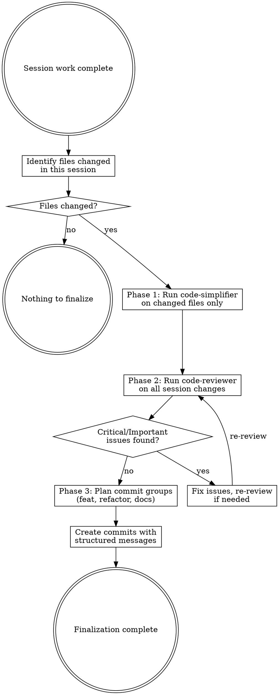

# Finalize Code

## Overview

Three-phase finalization: simplify changed code, review all changes, then commit with structured messages.

**Core principle:** Ship clean, reviewed code in well-organized commits.

**Announce at start:** "I'm using the finalize-code skill to simplify, review, and commit the session's work."

## The Process



## Step-by-Step

### Step 0: Identify Changed Files

Determine which files were changed in the current session:

```bash
# Unstaged + staged changes
git diff --name-only
git diff --cached --name-only

# Untracked new files
git ls-files --others --exclude-standard
```

Combine into a single list. These are the ONLY files to simplify. If no changes exist, stop and report "Nothing to finalize."

### Step 1: Run Code-Simplifier (Changed Files Only)

Invoke the `code-simplifier` agent on the changed files identified in Step 0.

**Scope constraint:** Only simplify files from the session change list. Do NOT touch unchanged files. Pass the explicit file list to the simplifier.

**What code-simplifier does:**
- Preserves all functionality
- Applies project standards from CLAUDE.md
- Reduces unnecessary complexity and nesting
- Eliminates redundant code
- Improves naming and readability

After simplification, verify the code still works:
```bash
# Run the project's test suite
npm test / cargo test / pytest / go test ./...
```

**If tests fail after simplification:** Revert the breaking simplification and note it. Do not ship broken simplifications.

### Step 2: Run Code-Reviewer on All Session Changes

Use the `codex-reviewer` skill to review all changes from the session.

**Gather context first:**
```bash
git diff HEAD
git diff --cached
git status
```

Follow the codex-reviewer process:
1. Send all session changes to Codex with context about what was implemented and why
2. Evaluate feedback using receiving-code-review principles
3. Fix valid Critical and Important issues
4. Push back on incorrect feedback with reasoning
5. Iterate until consensus (max 3 rounds)

**If codex is not available**, use the `superpowers:code-reviewer` subagent instead:
1. Get base and head SHAs
2. Dispatch code-reviewer subagent with the session's changes
3. Fix Critical issues immediately, Important issues before committing

**Do NOT skip review.** Do not proceed to Step 3 with unfixed Critical or Important issues.

### Step 3: Plan and Create Commits

Group changes into logical commits. Each commit must follow the format:

```
<type>(<scope>): one-line summary of changes

Long-form summary explaining:
- What changed and why
- Key decisions made
- Impact on existing behavior
```

#### Commit Grouping Rules

**Rule 1: Feature + its tests = one commit.**
A feature and its unit tests belong together. Never commit a feature without its tests or tests without their feature.

**Rule 2: Refactor and new feature = separate commits.**
Keep refactoring (changing structure without changing behavior) in its own commit, separate from new functionality.

**Rule 3: Plan docs go with their implementation.**
If a plan document was created for a feature, include it in the same commit as the implementation.

**Rule 4: Use conventional commit types:**

| Type | When |
|------|------|
| `feat` | New feature or capability |
| `fix` | Bug fix |
| `refactor` | Code restructuring, no behavior change |
| `test` | Test-only changes (adding tests for existing code) |
| `docs` | Documentation-only changes |
| `chore` | Build, config, tooling changes |

#### Creating the Commits

1. **Analyze all uncommitted changes** and categorize each file/hunk by type (feat, refactor, fix, etc.)
2. **Group related changes** following the rules above
3. **Stage and commit each group separately**, in logical order (refactors first, then features)

```bash
# Example: Commit a refactor
git add src/utils/parser.ts
git commit -m "$(cat <<'EOF'
refactor(parser): extract validation logic into separate functions

Broke down the monolithic parse() function into smaller, focused
functions: validateInput(), tokenize(), and buildAST(). No behavior
change - all existing tests pass unchanged.

Co-Authored-By: Claude Opus 4.6 <noreply@anthropic.com>
EOF
)"

# Example: Commit a feature with its tests and plan
git add src/features/export.ts src/features/__tests__/export.test.ts docs/plans/export-plan.md
git commit -m "$(cat <<'EOF'
feat(export): add CSV export for user data

Implements CSV export functionality per export-plan.md:
- New exportToCSV() function with configurable delimiters
- Handles nested objects via dot-notation flattening
- Includes header row generation from schema
- 12 unit tests covering edge cases and encoding

Co-Authored-By: Claude Opus 4.6 <noreply@anthropic.com>
EOF
)"
```

4. **Verify after all commits:**
```bash
git status  # Should be clean
git log --oneline -10  # Review commit history
```

## Common Mistakes

| Mistake | Fix |
|---------|-----|
| Simplifying files not changed in session | Only simplify files from Step 0 list |
| Skipping review to save time | Always review - it catches real issues |
| One giant commit for everything | Group by type: refactor, feat, fix separately |
| Feature commit without its tests | Always include unit tests with their feature |
| Committing broken simplifications | Run tests after simplification, revert failures |
| Vague commit messages like "update code" | Use `type(scope): specific summary` format |
| Mixing refactor and feature in one commit | Separate commits for different change types |

## Red Flags

**Never:**
- Simplify files that weren't changed in this session
- Skip the code review phase
- Commit with failing tests
- Combine refactoring and new features in one commit
- Write commit messages without the `type(scope):` prefix
- Commit features without their accompanying tests

**Always:**
- Identify session-changed files before simplifying
- Run tests after simplification
- Review all changes before committing
- Group feature + tests in one commit
- Keep refactor commits separate from feature commits
- Include plan docs with their implementation commit
